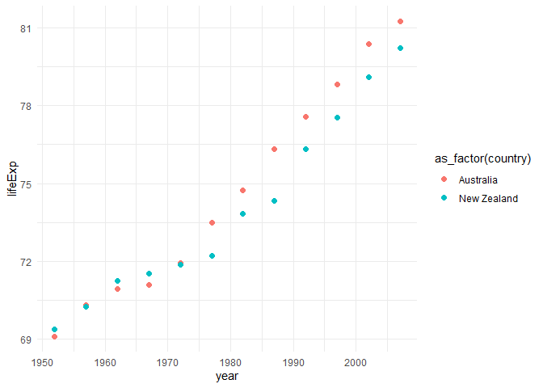

Gapminder
================
(Your name here)
2020-

- <a href="#grading-rubric" id="toc-grading-rubric">Grading Rubric</a>
  - <a href="#individual" id="toc-individual">Individual</a>
  - <a href="#due-date" id="toc-due-date">Due Date</a>
- <a href="#guided-eda" id="toc-guided-eda">Guided EDA</a>
  - <a
    href="#q0-perform-your-first-checks-on-the-dataset-what-variables-are-in-this"
    id="toc-q0-perform-your-first-checks-on-the-dataset-what-variables-are-in-this"><strong>q0</strong>
    Perform your “first checks” on the dataset. What variables are in
    this</a>
  - <a
    href="#q1-determine-the-most-and-least-recent-years-in-the-gapminder-dataset"
    id="toc-q1-determine-the-most-and-least-recent-years-in-the-gapminder-dataset"><strong>q1</strong>
    Determine the most and least recent years in the <code>gapminder</code>
    dataset.</a>
  - <a
    href="#q2-filter-on-years-matching-year_min-and-make-a-plot-of-the-gdp-per-capita-against-continent-choose-an-appropriate-geom_-to-visualize-the-data-what-observations-can-you-make"
    id="toc-q2-filter-on-years-matching-year_min-and-make-a-plot-of-the-gdp-per-capita-against-continent-choose-an-appropriate-geom_-to-visualize-the-data-what-observations-can-you-make"><strong>q2</strong>
    Filter on years matching <code>year_min</code>, and make a plot of the
    GDP per capita against continent. Choose an appropriate
    <code>geom_</code> to visualize the data. What observations can you
    make?</a>
  - <a
    href="#q3-you-should-have-found-at-least-three-outliers-in-q2-but-possibly-many-more-identify-those-outliers-figure-out-which-countries-they-are"
    id="toc-q3-you-should-have-found-at-least-three-outliers-in-q2-but-possibly-many-more-identify-those-outliers-figure-out-which-countries-they-are"><strong>q3</strong>
    You should have found <em>at least</em> three outliers in q2 (but
    possibly many more!). Identify those outliers (figure out which
    countries they are).</a>
  - <a
    href="#q4-create-a-plot-similar-to-yours-from-q2-studying-both-year_min-and-year_max-find-a-way-to-highlight-the-outliers-from-q3-on-your-plot-in-a-way-that-lets-you-identify-which-country-is-which-compare-the-patterns-between-year_min-and-year_max"
    id="toc-q4-create-a-plot-similar-to-yours-from-q2-studying-both-year_min-and-year_max-find-a-way-to-highlight-the-outliers-from-q3-on-your-plot-in-a-way-that-lets-you-identify-which-country-is-which-compare-the-patterns-between-year_min-and-year_max"><strong>q4</strong>
    Create a plot similar to yours from q2 studying both
    <code>year_min</code> and <code>year_max</code>. Find a way to highlight
    the outliers from q3 on your plot <em>in a way that lets you identify
    which country is which</em>. Compare the patterns between
    <code>year_min</code> and <code>year_max</code>.</a>
- <a href="#your-own-eda" id="toc-your-own-eda">Your Own EDA</a>
  - <a
    href="#q5-create-at-least-three-new-figures-below-with-each-figure-try-to-pose-new-questions-about-the-data"
    id="toc-q5-create-at-least-three-new-figures-below-with-each-figure-try-to-pose-new-questions-about-the-data"><strong>q5</strong>
    Create <em>at least</em> three new figures below. With each figure, try
    to pose new questions about the data.</a>

*Purpose*: Learning to do EDA well takes practice! In this challenge
you’ll further practice EDA by first completing a guided exploration,
then by conducting your own investigation. This challenge will also give
you a chance to use the wide variety of visual tools we’ve been
learning.

<!-- include-rubric -->

# Grading Rubric

<!-- -------------------------------------------------- -->

Unlike exercises, **challenges will be graded**. The following rubrics
define how you will be graded, both on an individual and team basis.

## Individual

<!-- ------------------------- -->

| Category    | Needs Improvement                                                                                                | Satisfactory                                                                                                               |
|-------------|------------------------------------------------------------------------------------------------------------------|----------------------------------------------------------------------------------------------------------------------------|
| Effort      | Some task **q**’s left unattempted                                                                               | All task **q**’s attempted                                                                                                 |
| Observed    | Did not document observations, or observations incorrect                                                         | Documented correct observations based on analysis                                                                          |
| Supported   | Some observations not clearly supported by analysis                                                              | All observations clearly supported by analysis (table, graph, etc.)                                                        |
| Assessed    | Observations include claims not supported by the data, or reflect a level of certainty not warranted by the data | Observations are appropriately qualified by the quality & relevance of the data and (in)conclusiveness of the support      |
| Specified   | Uses the phrase “more data are necessary” without clarification                                                  | Any statement that “more data are necessary” specifies which *specific* data are needed to answer what *specific* question |
| Code Styled | Violations of the [style guide](https://style.tidyverse.org/) hinder readability                                 | Code sufficiently close to the [style guide](https://style.tidyverse.org/)                                                 |

## Due Date

<!-- ------------------------- -->

All the deliverables stated in the rubrics above are due **at midnight**
before the day of the class discussion of the challenge. See the
[Syllabus](https://docs.google.com/document/d/1qeP6DUS8Djq_A0HMllMqsSqX3a9dbcx1/edit?usp=sharing&ouid=110386251748498665069&rtpof=true&sd=true)
for more information.

``` r
library(tidyverse)
```

    ## ── Attaching packages ─────────────────────────────────────── tidyverse 1.3.2 ──
    ## ✔ ggplot2 3.4.0      ✔ purrr   1.0.1 
    ## ✔ tibble  3.1.8      ✔ dplyr   1.0.10
    ## ✔ tidyr   1.2.1      ✔ stringr 1.5.0 
    ## ✔ readr   2.1.3      ✔ forcats 0.5.2 
    ## ── Conflicts ────────────────────────────────────────── tidyverse_conflicts() ──
    ## ✖ dplyr::filter() masks stats::filter()
    ## ✖ dplyr::lag()    masks stats::lag()

``` r
library(gapminder)
```

*Background*: [Gapminder](https://www.gapminder.org/about-gapminder/) is
an independent organization that seeks to educate people about the state
of the world. They seek to counteract the worldview constructed by a
hype-driven media cycle, and promote a “fact-based worldview” by
focusing on data. The dataset we’ll study in this challenge is from
Gapminder.

# Guided EDA

<!-- -------------------------------------------------- -->

First, we’ll go through a round of *guided EDA*. Try to pay attention to
the high-level process we’re going through—after this guided round
you’ll be responsible for doing another cycle of EDA on your own!

### **q0** Perform your “first checks” on the dataset. What variables are in this

dataset?

``` r
## TASK: Do your "first checks" here!
glimpse(gapminder)
```

    ## Rows: 1,704
    ## Columns: 6
    ## $ country   <fct> "Afghanistan", "Afghanistan", "Afghanistan", "Afghanistan", …
    ## $ continent <fct> Asia, Asia, Asia, Asia, Asia, Asia, Asia, Asia, Asia, Asia, …
    ## $ year      <int> 1952, 1957, 1962, 1967, 1972, 1977, 1982, 1987, 1992, 1997, …
    ## $ lifeExp   <dbl> 28.801, 30.332, 31.997, 34.020, 36.088, 38.438, 39.854, 40.8…
    ## $ pop       <int> 8425333, 9240934, 10267083, 11537966, 13079460, 14880372, 12…
    ## $ gdpPercap <dbl> 779.4453, 820.8530, 853.1007, 836.1971, 739.9811, 786.1134, …

**Observations**:

- Variable names: country, continent, year, LifeExp, Pop, gdpPercap

### **q1** Determine the most and least recent years in the `gapminder` dataset.

*Hint*: Use the `pull()` function to get a vector out of a tibble.
(Rather than the `$` notation of base R.)

``` r
## TASK: Find the largest and smallest values of `year` in `gapminder`
  
year_max <- max(pull(gapminder, year))
year_min <- min(pull(gapminder, year))

year_max
```

    ## [1] 2007

``` r
year_min
```

    ## [1] 1952

Use the following test to check your work.

``` r
## NOTE: No need to change this
assertthat::assert_that(year_max %% 7 == 5)
```

    ## [1] TRUE

``` r
assertthat::assert_that(year_max %% 3 == 0)
```

    ## [1] TRUE

``` r
assertthat::assert_that(year_min %% 7 == 6)
```

    ## [1] TRUE

``` r
assertthat::assert_that(year_min %% 3 == 2)
```

    ## [1] TRUE

``` r
if (is_tibble(year_max)) {
  print("year_max is a tibble; try using `pull()` to get a vector")
  assertthat::assert_that(False)
}

print("Nice!")
```

    ## [1] "Nice!"

### **q2** Filter on years matching `year_min`, and make a plot of the GDP per capita against continent. Choose an appropriate `geom_` to visualize the data. What observations can you make?

You may encounter difficulties in visualizing these data; if so document
your challenges and attempt to produce the most informative visual you
can.

``` r
## TASK: Create a visual of gdpPercap vs continent
gapminder %>%
  filter(year == year_min)  %>%
  select(continent, gdpPercap)   %>%
  ggplot(aes(x = continent, y = gdpPercap)) +
  geom_bar(stat = "identity") +
  ggtitle("Continent vs. GDP per Capita in 1952")
```

<!-- -->

**Observations**:  

- Write your observations here:
  - It seems that out of the continents in the data set, Asia and Europe
    have the highest cumulative GDP per capita. Oceania has the lowest
    cumulative GDP per capita out of the continents in the dataset. This
    makes sense because Oceania has the least amount of countries among
    the continents with it only counting Australia and New Zealand.

**Difficulties & Approaches**:

- The challenge with this bar graph is that we want to visualize GDP per
  capita per continent but larger continents have more countries and
  therefore larger GDP per capitas. I think that we could instead
  average the GDP per capita per country per continent if we wanted to
  compare each continent’s GDP per capitas with one another.

### **q3** You should have found *at least* three outliers in q2 (but possibly many more!). Identify those outliers (figure out which countries they are).

``` r
## TASK: Identify the outliers from q2

gapminder %>%
  filter(year == year_min)  %>%
  select(continent, gdpPercap)   %>%
  ggplot(aes(x = continent, y = gdpPercap)) +
  geom_boxplot() +
  ggtitle("Continent vs. GDP per Capita in 1952")
```

<!-- -->

``` r
gapminder %>%
  filter(year == year_min)  %>%
  group_by(continent)  %>%
  filter(gdpPercap >= (quantile(gdpPercap, 0.75) + 1.5*IQR(gdpPercap))) 
```

    ## # A tibble: 9 × 6
    ## # Groups:   continent [4]
    ##   country       continent  year lifeExp       pop gdpPercap
    ##   <fct>         <fct>     <int>   <dbl>     <int>     <dbl>
    ## 1 Angola        Africa     1952    30.0   4232095     3521.
    ## 2 Bahrain       Asia       1952    50.9    120447     9867.
    ## 3 Canada        Americas   1952    68.8  14785584    11367.
    ## 4 Gabon         Africa     1952    37.0    420702     4293.
    ## 5 Kuwait        Asia       1952    55.6    160000   108382.
    ## 6 South Africa  Africa     1952    45.0  14264935     4725.
    ## 7 Switzerland   Europe     1952    69.6   4815000    14734.
    ## 8 United States Americas   1952    68.4 157553000    13990.
    ## 9 Venezuela     Americas   1952    55.1   5439568     7690.

``` r
gapminder %>%
  filter(year == year_min)  %>%
  group_by(continent)  %>%
  filter(gdpPercap <= (quantile(gdpPercap, 0.25) - 1.5*IQR(gdpPercap))) 
```

    ## # A tibble: 0 × 6
    ## # Groups:   continent [0]
    ## # … with 6 variables: country <fct>, continent <fct>, year <int>,
    ## #   lifeExp <dbl>, pop <int>, gdpPercap <dbl>

**Observations**:

- I found 9 outliers from the data set using the definition that
  outliers are countries with a gdp per capita greater than 1.5\*IQR of
  the third quartile and less than 1.5\*IQR of the first quartile within
  their continent grouping. I noticed that all the outliers within this
  data set are countries that have a much higher GDP per capita than the
  other countries in the continent grouping. Much of the outliers come
  from Africa and the Ameriacs, with two in Asia and one in Europe.

  ## Identify the outlier countries from q2

*Hint*: For the next task, it’s helpful to know a ggplot trick we’ll
learn in an upcoming exercise: You can use the `data` argument inside
any `geom_*` to modify the data that will be plotted *by that geom
only*. For instance, you can use this trick to filter a set of points to
label:

``` r
## NOTE: No need to edit, use ideas from this in q4 below
gapminder %>%
  filter(year == max(year)) %>%

  ggplot(aes(continent, lifeExp)) +
  geom_boxplot() +
  geom_point(
    data = . %>% filter(country %in% c("United Kingdom", "Japan", "Zambia")),
    mapping = aes(color = country),
    size = 2
  )
```

<!-- -->

### **q4** Create a plot similar to yours from q2 studying both `year_min` and `year_max`. Find a way to highlight the outliers from q3 on your plot *in a way that lets you identify which country is which*. Compare the patterns between `year_min` and `year_max`.

*Hint*: We’ve learned a lot of different ways to show multiple
variables; think about using different aesthetics or facets.

``` r
## TASK: Create a visual of gdpPercap vs continent

gapminder %>%
  filter(year == min(year)) %>%

  ggplot(aes(continent, gdpPercap)) +
  geom_boxplot() +
  geom_point(
    data = . %>% filter(country %in% c("Angola", "Bahrain", "Canada", "Gabon", "Kuwait", "South Africa", "Switzerland", "United States", "Venezuela")),
    mapping = aes(color = country),
    size = 2
  ) + 
    ggtitle('Continent vs. GDP per capita in 1952')
```

<!-- -->

``` r
gapminder %>%
  filter(year == year_max)  %>%
  group_by(continent)  %>%
  filter(gdpPercap >= (quantile(gdpPercap, 0.75) + 1.5*IQR(gdpPercap))) 
```

    ## # A tibble: 8 × 6
    ## # Groups:   continent [2]
    ##   country           continent  year lifeExp       pop gdpPercap
    ##   <fct>             <fct>     <int>   <dbl>     <int>     <dbl>
    ## 1 Botswana          Africa     2007    50.7   1639131    12570.
    ## 2 Canada            Americas   2007    80.7  33390141    36319.
    ## 3 Equatorial Guinea Africa     2007    51.6    551201    12154.
    ## 4 Gabon             Africa     2007    56.7   1454867    13206.
    ## 5 Libya             Africa     2007    74.0   6036914    12057.
    ## 6 Mauritius         Africa     2007    72.8   1250882    10957.
    ## 7 South Africa      Africa     2007    49.3  43997828     9270.
    ## 8 United States     Americas   2007    78.2 301139947    42952.

``` r
gapminder %>%
  filter(year == year_max)  %>%
  group_by(continent)  %>%
  filter(gdpPercap <= (quantile(gdpPercap, 0.25) - 1.5*IQR(gdpPercap))) 
```

    ## # A tibble: 0 × 6
    ## # Groups:   continent [0]
    ## # … with 6 variables: country <fct>, continent <fct>, year <int>,
    ## #   lifeExp <dbl>, pop <int>, gdpPercap <dbl>

``` r
gapminder %>%
  filter(year == max(year)) %>%
  ggplot(aes(continent, gdpPercap)) +
  geom_boxplot() +
  geom_point(
    data = . %>% filter(country %in% c("Botswana", "Canada", "Equatorial Guinea", "Gabon", "Libya", "Mauritius", "South Africa", "United States")),
    mapping = aes(color = country),
    size = 2
  ) +
  ggtitle('Continent vs. GDP per capita in 2007')
```

<!-- -->

**Observations**:

- In the 1952 Continent vs. GDP per capita plot, the country that by far
  was the largest outlier within its continent was Kuwait within Asia.
- In the 2007 Continent vs. GDP per capita plot, the outliers were
  predominantly found in Africa and Asia. The largest outlier within a
  continent would go to the United states within the Americas continent.

# Your Own EDA

<!-- -------------------------------------------------- -->

Now it’s your turn! We just went through guided EDA considering the GDP
per capita at two time points. You can continue looking at outliers,
consider different years, repeat the exercise with `lifeExp`, consider
the relationship between variables, or something else entirely.

### **q5** Create *at least* three new figures below. With each figure, try to pose new questions about the data.

``` r
## TASK: Your first graph

gapminder %>%
  filter(continent == 'Oceania') %>%
  ggplot(aes(year, lifeExp, color = as_factor(country))) +
  geom_point(size = 2) +
  theme_minimal()
```

<!-- -->

- When looking at the Life expectancy of the continent of Oceania over
  time, we see a general upwards trend from 1950 to 2007. After 1970,
  Australia has had a slightly higher life expectancy than New Zealand.

``` r
## TASK: Your second graph

gapminder %>%
  filter(year == year_max) %>%
  ggplot(aes(lifeExp, gdpPercap)) +
  geom_point(size = 2) +
  ggtitle("Life Expectancy vs. GDP Per Capita in the year 2007")
```

<!-- -->

- It seems that when we plot life expectancy against gdp per capita for
  countries in 2007, there seem to be a general positive correlation
  after the country reaches a life expectancy of 70 or more. Before the
  life expectancy of 70, there seems to be little or no correlation
  between life expectancy and gdp per capita. From this chart we can
  assume that countries with lower gdp per capita have a wide range of
  life expectancies from 40 to 70.

``` r
## TASK: Your third graph

gapminder %>%
  filter(country == "Philippines") %>%
  ggplot(aes(year, gdpPercap))+
  geom_point(size = 2) +
  theme_minimal() + 
  ggtitle("Philippines GDP Per capita over time")
```

<!-- -->

- Philippines has been increasing in GDP per capita over time with an
  exception during the mid 1980’s when the trend suffered a dip.
  According to Philippine history, the mid late 70s was a period of high
  economic growth due to the world’s increased demand for commodities
  such as Philippine coconut and sugar. This was followed by a recession
  in the 80s due to a combination of lavish spending under the Marcos
  Regime, political instability from former president Ninoy’s
  assassination, and a rise in global oil prices.
