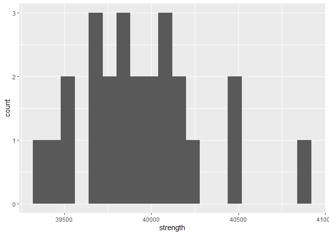

Structural Safety
================
(Your name here)
202X-XX-XX

- <a href="#grading-rubric" id="toc-grading-rubric">Grading Rubric</a>
  - <a href="#individual" id="toc-individual">Individual</a>
  - <a href="#due-date" id="toc-due-date">Due Date</a>
- <a href="#setup" id="toc-setup">Setup</a>
  - <a
    href="#q1-visualize-the-strength-data-with-a-histogram-answer-the-questions-below"
    id="toc-q1-visualize-the-strength-data-with-a-histogram-answer-the-questions-below"><strong>q1</strong>
    Visualize the strength data with a histogram. Answer the questions
    below.</a>
- <a href="#assessing-structural-safety"
  id="toc-assessing-structural-safety">Assessing Structural Safety</a>
  - <a href="#structural-model" id="toc-structural-model">Structural
    model</a>
    - <a
      href="#q2-using-the-observations-in-df_samples-and-the-structural-model-g_break-estimate-the-probability-of-failure"
      id="toc-q2-using-the-observations-in-df_samples-and-the-structural-model-g_break-estimate-the-probability-of-failure"><strong>q2</strong>
      Using the observations in <code>df_samples</code> and the structural
      model <code>g_break()</code>, estimate the probability of failure.</a>
  - <a href="#material-property-model"
    id="toc-material-property-model">Material property model</a>
    - <a
      href="#q3-fit-a-lognormal-distribution-to-the-strength-data-using-the-fitdistr-function"
      id="toc-q3-fit-a-lognormal-distribution-to-the-strength-data-using-the-fitdistr-function"><strong>q3</strong>
      Fit a lognormal distribution to the strength data using the
      <code>fitdistr()</code> function.</a>
    - <a
      href="#q4-complete-the-code-below-by-1-choosing-a-monte-carlo-sample-size-n_monte_carlo-2-extracting-the-estimated-parameters-from-q3-and-3-computing-the-limit-state-value-g--g_break-answer-the-questions-under-observations-below"
      id="toc-q4-complete-the-code-below-by-1-choosing-a-monte-carlo-sample-size-n_monte_carlo-2-extracting-the-estimated-parameters-from-q3-and-3-computing-the-limit-state-value-g--g_break-answer-the-questions-under-observations-below"><strong>q4</strong>
      Complete the code below by 1. choosing a Monte Carlo sample size
      <code>n_monte_carlo</code>, 2. extracting the estimated parameters from
      q3, and 3. computing the limit state value <code>g = g_break()</code>.
      Answer the questions under <em>observations</em> below.</a>
  - <a href="#a-different-way-to-compute-the-pof"
    id="toc-a-different-way-to-compute-the-pof">A different way to compute
    the POF</a>
    - <a
      href="#q5-finish-the-following-function-by-computing-the-pof-with-plnorm-answer-the-questions-under-observations-below"
      id="toc-q5-finish-the-following-function-by-computing-the-pof-with-plnorm-answer-the-questions-under-observations-below"><strong>q5</strong>
      Finish the following function by computing the POF with
      <code>plnorm()</code>. Answer the questions under <em>observations</em>
      below.</a>
  - <a href="#quantifying-sampling-uncertainty"
    id="toc-quantifying-sampling-uncertainty">Quantifying sampling
    uncertainty</a>
    - <a
      href="#q6-the-code-below-estimates-a-bootstrap-ci-on-your-pof-estimate-answer-the-questions-under-observations-below"
      id="toc-q6-the-code-below-estimates-a-bootstrap-ci-on-your-pof-estimate-answer-the-questions-under-observations-below"><strong>q6</strong>
      The code below estimates a bootstrap CI on your POF estimate. Answer the
      questions under <em>observations</em> below.</a>

*Purpose*: Most real problems have multiple sources of uncertainty mixed
together. Untangling these different sources can be challenging, even on
a conceptual level. In this challenge we’ll study a simple problem of
structural safety, and use this small case study to untangle sources of
sampling and Monte Carlo uncertainty.

*Note*: In this challenge I provide a lot of stub-code; you won’t have
to do too much coding. This is because I want you to *focus on answering
the conceptual questions*. The most important questions in this
challenge are: *What sources of uncertainty are you accounting for? What
sources are you not accounting for? Are those sources real or induced?*

<!-- include-rubric -->

# Grading Rubric

<!-- -------------------------------------------------- -->

Unlike exercises, **challenges will be graded**. The following rubrics
define how you will be graded, both on an individual and team basis.

## Individual

<!-- ------------------------- -->

| Category    | Needs Improvement                                                                                                | Satisfactory                                                                                                               |
|-------------|------------------------------------------------------------------------------------------------------------------|----------------------------------------------------------------------------------------------------------------------------|
| Effort      | Some task **q**’s left unattempted                                                                               | All task **q**’s attempted                                                                                                 |
| Observed    | Did not document observations, or observations incorrect                                                         | Documented correct observations based on analysis                                                                          |
| Supported   | Some observations not clearly supported by analysis                                                              | All observations clearly supported by analysis (table, graph, etc.)                                                        |
| Assessed    | Observations include claims not supported by the data, or reflect a level of certainty not warranted by the data | Observations are appropriately qualified by the quality & relevance of the data and (in)conclusiveness of the support      |
| Specified   | Uses the phrase “more data are necessary” without clarification                                                  | Any statement that “more data are necessary” specifies which *specific* data are needed to answer what *specific* question |
| Code Styled | Violations of the [style guide](https://style.tidyverse.org/) hinder readability                                 | Code sufficiently close to the [style guide](https://style.tidyverse.org/)                                                 |

## Due Date

<!-- ------------------------- -->

All the deliverables stated in the rubrics above are due **at midnight**
before the day of the class discussion of the challenge. See the
[Syllabus](https://docs.google.com/document/d/1qeP6DUS8Djq_A0HMllMqsSqX3a9dbcx1/edit?usp=sharing&ouid=110386251748498665069&rtpof=true&sd=true)
for more information.

# Setup

<!-- ----------------------------------------------------------------------- -->

``` r
library(MASS)
library(rsample)
library(broom)
library(tidyverse)
```

    ## ── Attaching packages ─────────────────────────────────────── tidyverse 1.3.2 ──
    ## ✔ ggplot2 3.4.0      ✔ purrr   1.0.1 
    ## ✔ tibble  3.1.8      ✔ dplyr   1.0.10
    ## ✔ tidyr   1.2.1      ✔ stringr 1.5.0 
    ## ✔ readr   2.1.3      ✔ forcats 0.5.2 
    ## ── Conflicts ────────────────────────────────────────── tidyverse_conflicts() ──
    ## ✖ dplyr::filter() masks stats::filter()
    ## ✖ dplyr::lag()    masks stats::lag()
    ## ✖ dplyr::select() masks MASS::select()

``` r
filename_samples <- "./data/al_samples.csv"
```

*Background*: The
[strength](https://en.wikipedia.org/wiki/Ultimate_tensile_strength) of a
material is the amount of mechanical stress it can survive before
breaking. To illustrate: Stresses are internal forces that hold an
object together when we try to squeeze, stretch, or otherwise deform a
solid object. For instance, if we pull on a rectangular bar of material,
internal stresses $\sigma$ work to keep the bar together.


By Jorge Stolfi - Own work, CC BY-SA 3.0,
<https://commons.wikimedia.org/w/index.php?curid=24499456>

*Strength* is a measure of how much internal stress an object can
survive: A higher strength means a stronger material. This challenge’s
data are very simple: They are (synthetic) observations of ultimate
tensile strength (UTS) on individual samples of the same aluminum alloy.
The experiments were carried out following the highest standards of
experimental rigor, so you should consider these values to be the “true”
breaking strength for each sample.

``` r
## NOTE: No need to edit; load data
df_samples <- read_csv(filename_samples)
```

    ## Rows: 25 Columns: 1
    ## ── Column specification ────────────────────────────────────────────────────────
    ## Delimiter: ","
    ## dbl (1): strength
    ## 
    ## ℹ Use `spec()` to retrieve the full column specification for this data.
    ## ℹ Specify the column types or set `show_col_types = FALSE` to quiet this message.

``` r
summarize(df_samples, mean = mean(strength))
```

    ## # A tibble: 1 × 1
    ##     mean
    ##    <dbl>
    ## 1 39941.

``` r
df_samples
```

    ## # A tibble: 25 × 1
    ##    strength
    ##       <dbl>
    ##  1   39484.
    ##  2   39812.
    ##  3   40052.
    ##  4   40519.
    ##  5   40045.
    ##  6   40160.
    ##  7   40094.
    ##  8   39674.
    ##  9   40144.
    ## 10   39865.
    ## # … with 15 more rows

Data Dictionary:

| Quantity       | Units |
|----------------|-------|
| Strength (UTS) | psi   |

### **q1** Visualize the strength data with a histogram. Answer the questions below.

``` r
ggplot(data = df_samples) +
  geom_histogram(mapping = aes(x = strength), binwidth = 80)
```

<!-- -->

**Observations**:

- What is the mean strength of the material, approximately?
  - Mean strength approximately is 39941 psi.
- To what extent can you tell what shape the distribution of the data
  has?
  - Generally, I see a right-skewed shaped distribution when looking at
    the histogram because the data cluster has a longer tail to the
    right. However, there are only 25 data points and more should be
    gathered to be more sure about the distribution shape.
- Assuming the scopus is the strength of an individual part made from
  this aluminum alloy, is the observed variability real or induced?
  - Real - the breaking strength of Aluminum depends on how micro cracks
    propagate within the material. Because every piece of Aluminum is
    different with different amounts and areas of cracks, there is real
    variability between different Aluminum sample strengths.

# Assessing Structural Safety

<!-- ----------------------------------------------------------------------- -->

*Objective*: In this challenge you are going to study a structure and
assess its *probability of failure* (POF). A higher POF corresponds to a
more unsafe structure. Ultimately, we want

$$\text{POF} < 0.03.$$

Your job is to assess a given structure using the data provided and
determine whether you can *confidently* conclude that `POF < 0.03`.

## Structural model

<!-- --------------------------------------- -->

The following code chunk sets up a structural model: We are considering
a rectangular bar under uniaxial tensile load (as pictured above). A
larger cross-sectional area `A` is capable of surviving a greater load
`L`, but a larger `A` is a heavier (more expensive) structure. The
internal stress is approximately `sigma = L / A`—we simply compare this
quantity against the strength.

I pick particular values for `A, L` and package all the information in
the *limit state function* `g_break`:

``` r
## NOTE: No need to edit; model setup
A <- 0.0255 # Cross-sectional area
L <- 1000 # Applied load (lbs)

g_break <- function(strength) {
  strength - L / A
}

g_break(38000)
```

    ## [1] -1215.686

The *probability of failure* (POF) is then defined in terms of the limit
state $g$ via:

$$\text{POF} \equiv \mathbb{P}[g \leq 0].$$

### **q2** Using the observations in `df_samples` and the structural model `g_break()`, estimate the probability of failure.

*Hint*: In `c07-monte-carlo` you learned how to estimate a probability
as the `mean()` of an indicator. Use the same strategy here.

``` r
## TODO: Estimate the probability of failure; i.e. POF = Pr[g <= 0]

df_samples %>% 
  mutate( g = g_break(strength), fail = (g <= 0) ) %>% 
  summarize(count_total = n(), count_fail = sum(fail), POF = mean(fail)) 
```

    ## # A tibble: 1 × 3
    ##   count_total count_fail   POF
    ##         <int>      <int> <dbl>
    ## 1          25          0     0

**Observations**:

- Does this estimate satisfy `POF < 0.03`?
  - This estimate satisfies POF \< 0.03 because calculated POF is 0 from
    the 25 samples. This is because none of the samples in this data set
    were weak enough to fall under the threshold strength.
- Is this estimate of the probability of failure trustworthy? Why or why
  not?
  - No, because it is almost impossible to have a 0% failure rate in
    materials. There are always chances of hidden defects within
    materials such as aluminum by how it is manufactured. Our sample
    size is small so seeing 0 as the calculated POF within our samples
    is not surprising. To be more confident in our answer, we should
    test more samples or approximate the distribution using the Monte
    Carlo or cdf method and find more reasonable non-0 POF values.
- Can you confidently conclude that `POF < 0.03`? Why or why not.
  - No, because there is a large chance for error and variability
    affecting the POF especially with a low sample size. We need to
    increase sample size to feel more confident about our POF
    approximation.

## Material property model

<!-- --------------------------------------- -->

Since we have so few physical samples, we will fit a distribution to
model the material property. This will give us the means to draw
“virtual samples” and use those to estimate the POF.

### **q3** Fit a lognormal distribution to the strength data using the `fitdistr()` function.

*Note*: In this challenge I generated the `strength` data from a
`lognormal` distribution; if you didn’t know that fact, then the choice
of distribution would be an *additional* source of uncertainty!

*Hint 1*: We learned how to do this in `e-stat08-fit-dist`.

*Hint 2*: The `fitdistr` function uses `densfun = "lognormal"` to
specify a lognormal distribution.

``` r
## TODO:
df_fit <- 
  df_samples %>%
  pull(strength) %>%
  fitdistr(densfun = "lognormal") %>%
  tidy()

df_fit
```

    ## # A tibble: 2 × 3
    ##   term    estimate std.error
    ##   <chr>      <dbl>     <dbl>
    ## 1 meanlog 10.6       0.00175
    ## 2 sdlog    0.00875   0.00124

Once you’ve successfully fit a model for the strength, you can estimate
the probability of failure by drawing samples from the fitted
distribution.

### **q4** Complete the code below by 1. choosing a Monte Carlo sample size `n_monte_carlo`, 2. extracting the estimated parameters from q3, and 3. computing the limit state value `g = g_break()`. Answer the questions under *observations* below.

*Hint 1*: You will need to combine ideas from `c07-monte-carlo` and
`e-stat08-fit-dist` in order to complete this task.

*Hint 2*: The function `rlnorm()` will allow you to draw samples from a
lognormal distribution.

``` r
## TODO 1: Choose Monte Carlo sample size
n_monte_carlo <- 1000

## TODO 2: Extract parameter estimates from df_fit
strength_meanlog <-df_fit %>%
  filter(term == "meanlog") %>%
  pull(estimate)

strength_sdlog <- df_fit %>%
  filter(term == "sdlog") %>%
  pull(estimate)

# Generate samples
df_norm_sim <-
  tibble(strength = rlnorm(n_monte_carlo, strength_meanlog, strength_sdlog)) %>%
## TODO 3: Compute structural response
  mutate(g = g_break(strength))

## NOTE: The following code estimates the POF and a 95% confidence interval
df_norm_pof <-
  df_norm_sim %>%
  mutate(stat = g <= 0) %>%
  summarize(
    pof_est = mean(stat),
    se = sd(stat) / sqrt(n_monte_carlo)
  ) %>%
  mutate(
    pof_lo = pof_est - 1.96 * se,
    pof_hi = pof_est + 1.96 * se
  ) %>%
  select(pof_lo, pof_est, pof_hi)

df_norm_pof
```

    ## # A tibble: 1 × 3
    ##   pof_lo pof_est pof_hi
    ##    <dbl>   <dbl>  <dbl>
    ## 1 0.0113    0.02 0.0287

- Assuming your scopus is the probability of failure `POF` defined
  above, does your estimate exhibit real variability, induced
  variability, or both?
  - Induced variability- we can have induced variability from df_samples
    due to there being limited strength data in the dataset which could
    influence our POF estimate.
- Does this confidence interval imply that `POF < 0.03`?
  - Yes, the 95% confidence interval only includes the POF below 0.03.
    The evidence suggests the true POF lies between 0.00976 and 0.0262
- Compare this probability with your estimate from q2; is it more or
  less trustworthy?
  - This estimate is more trustworthy because it essentially fits the
    distribution to a distribution we could sample many times (1000),
    and we calculate the POF and confidence interval from the 1000
    samples. This is more trustworthy than calculating POF the existing
    25 measurements because there is many more data points and therefore
    higher fidelity. If you think about it, if only 1/25 of the
    measurements failed, we get POF = 0.04 which could make us think
    that the POF is actually higher than the real values.
- Does the confidence interval above account for uncertainty arising
  from the *Monte Carlo approximation*? Why or why not?
  - Yes, the confidence interval helps to decide how precise a sample
    estimate is and therefore accounts for the uncertainty from the
    Monte Carlo approximation. It specifies a range of values likely to
    contain the unknown population value using the standard error from
    the 1000 samples made (calculated from the standard deviation).
- Does the confidence interval above account for uncertainty arising
  from *limited physical tests* (`df_samples`)? Why or why not?
  - No it doesn’t. We are assuming that the df_samples distribution fits
    a log normal distribution. With our limited sampling (25 samples),
    the distribution could be another shape as opposed to log normal.
    There is also a chance that there is an error in the production of
    Aluminum or measurement taking that would influence where the
    distribution is centered on. For example, consistent factory defects
    or measurement error could heavily influence df_samples given that
    there is such a low number of samples.
- What could you do to tighten up the confidence interval?
  - To tighten up the confidence interval, you would need a lower
    standard deviation among samples. You can increase the sample size
    of Monte Carlo samples and that would help tighten up the confidence
    interval up to an extent because standard deviation would approach a
    value instead of continually decreasing.
- Can you *confidently* conclude that `POF < 0.03`? Why or why not?
  - We can’t be 100 percent confident that the POF \< 0.03 because of
    uncertainty in the Monte Carlo approximation and the fact that there
    is variability in our measurements of aluminum.

## A different way to compute the POF

<!-- --------------------------------------- -->

Monte Carlo is a *general* way to estimate probabilities, but it
introduces approximation error. It turns out that, for the simple
problem we’re studying, we can compute the probability directly using
the CDF. Note that for our structural safety problem, we have

$$\text{POF} = \mathbb{P}[g \leq 0] = \mathbb{P}[S \leq L / A] = \text{CDF}_S(L/A).$$

Since
`S = rlnorm(n, meanlog = strength_meanlog, sdlog = strength_sdlog)`, we
can use `plnorm` to compute the probability of failure without Monte
Carlo as
`POF = plnorm(L/A, meanlog = strength_meanlog, sdlog = strength_sdlog)`.
Let’s combine this idea with the fitted distribution to estimate the
POF.

### **q5** Finish the following function by computing the POF with `plnorm()`. Answer the questions under *observations* below.

``` r
## TODO: Complete the function below;
##       note that you only need to edit the TODO section

estimate_pof <- function(df) {
  ## Fit the distribution
  df_fit <-
    df %>%
    pull(strength) %>%
    fitdistr(densfun = "lognormal") %>%
    tidy()

  ## Extract the parameters
  strength_meanlog <-
    df_fit %>%
    filter(term == "meanlog") %>%
    pull(estimate)
  strength_sdlog <-
    df_fit %>%
    filter(term == "sdlog") %>%
    pull(estimate)

## TODO: Estimate the probability of failure using plnorm
  pof_estimate <- plnorm(L/A, meanlog = strength_meanlog, sdlog = strength_sdlog)

  ## NOTE: No need to edit; this last line returns your pof_estimate
  pof_estimate
}

## NOTE: No need to edit; test your function
df_samples %>% estimate_pof()
```

    ## [1] 0.01832289

**Observations**:

- How does this estimate compare with your Monte Carlo estimate above?
  - This estimate computes the integral under the lognormal curve up to
    the parameter (breaking strength) which exactly computes the POF of
    the fitted distribution. On the other hand, the Monte Carlo estimate
    samples the fitted distribution n number of times to produce an
    averaged estimate of the POF with Monte Carlo sampling uncertainty.
- Does this estimate have any uncertainty due to *Monte Carlo
  approximation*? Why or why not?
  - No, because this estimate doesn’t use Monte Carlo sampling. The
    estimate calculates the POF of the fitted lognormal distribution
    without needing to sample the same distribution a n number of times.
- With the scopus as the `POF`, would uncertainty due to *Monte Carlo
  approximation* be induced or real?
  - The uncertainty due to Monte Carlo approximation would be real
    because the Monte Carlo approximation doesn’t have any bias or human
    error as it randomly chooses data points from a fitted distribution
    and reruns the strength approximation n number of times to calculate
    an approximated POF value.
- Does this estimate have any uncertainty due to *limited physical
  tests*? Why or why not?
  - Yes, because we are still fitting the lognormal distribution to
    df_samples which has limited tests. With this lognormal
    distribution, we calculate the approximate mean and standard
    deviation and use these estimates determine the POF with this
    method. There is always uncertainty when using df_samples because
    the mean and standard deviation could widely change when we add more
    data points and the true shape may not even be normal.
- With the scopus as the `POF`, would uncertainty due to *limited
  physical tests* be induced or real?
  - The uncertainty due to limited physical tests could induced and
    real. It could be induced because there is a chance that there is a
    consistent defect in manufacturing the Aluminum as well as testing
    the Aluminum too. It also can have real variability due to the
    randomness of the location and size of the micro-cracks within the
    Aluminum material which determines the true breaking strength of
    each sample.

## Quantifying sampling uncertainty

<!-- --------------------------------------- -->

Using `plnorm()` gets rid of Monte Carlo error, but we still have
uncertainty due to limited physical testing. Often we can use a CLT
approximation to construct a confidence interval. However, with
`plnorm()` we can’t use a CLT approximation because it does not follow
the assumptions of the central limit theorem (it’s not a sum of iid
random variables). Instead, we can use the *bootstrap* to approximate a
confidence interval via resampling.

### **q6** The code below estimates a bootstrap CI on your POF estimate. Answer the questions under *observations* below.

``` r
## NOTE: No need to edit; run and inspect
tidycustom <- function(est) {tibble(term = "pof", estimate = est)}

df_samples %>%
  bootstraps(times = 1000) %>%
  mutate(
    estimates = map(
      splits,
      ~ analysis(.x) %>% estimate_pof() %>% tidycustom()
    )
  ) %>%
  int_pctl(estimates)
```

    ## # A tibble: 1 × 6
    ##   term   .lower .estimate .upper .alpha .method   
    ##   <chr>   <dbl>     <dbl>  <dbl>  <dbl> <chr>     
    ## 1 pof   0.00140    0.0177 0.0471   0.05 percentile

**Observations**:

- Does the confidence interval above account for uncertainty arising
  from *Monte Carlo approximation* of the POF? Why or why not?
  - No, the confidence interval above accounts for the uncertainty from
    the plnorm() estimate which is different from the Monte Carlo
    approximation.
- Does the confidence interval above account for uncertainty arising
  from *limited physical tests* (`df_samples`)? Why or why not?
  - Yes, the confidence interval above accounts for the uncertainty
    arising from limited physical tests because it only resamples from
    our original sample to calculate POF.
- Can you confidently conclude that `POF < 0.03`? Why or why not?
  - No, because POF = 0.03 falls within our 95% confidence interval
    (0.0010 - 0.0490). Because in our confidence interval we see POF’s
    of above 0.03, evidence suggests that we cannot confidently conclude
    that POF \< 0.03.
